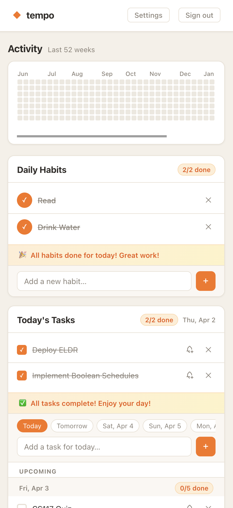
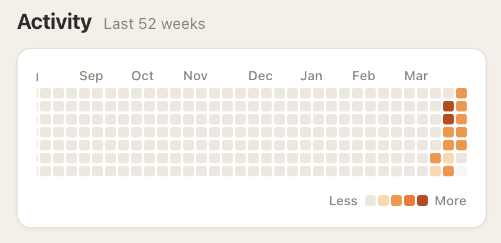
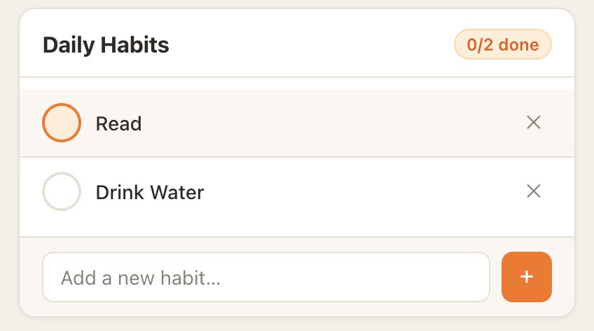
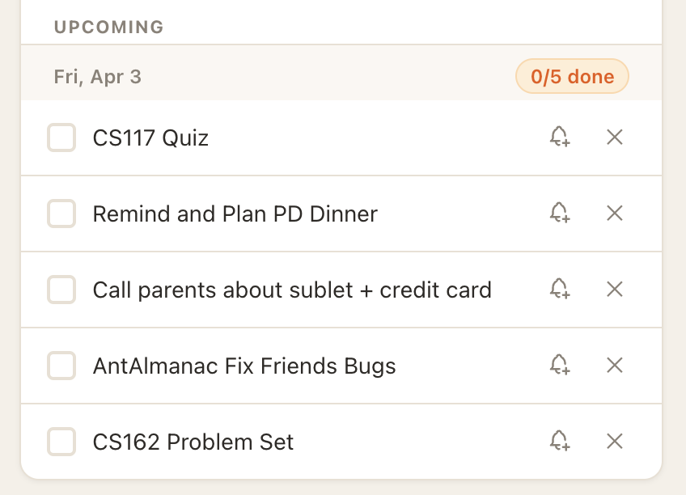
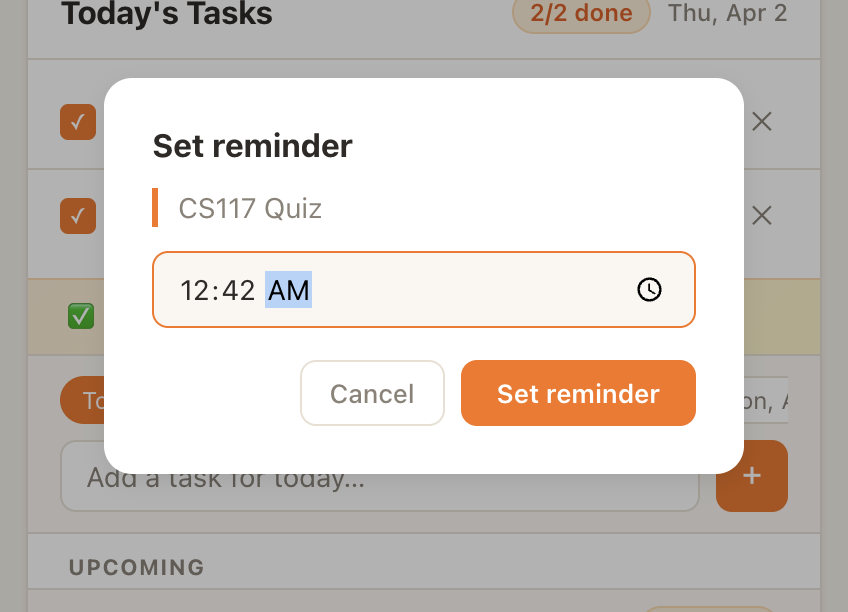

<div align="center">

# ◆ tempo

**I refused to pay $5/month for a habit tracker. Now I pay $5/month to host my own server.**

Built for personal use after not wanting to pay for yet another productivity app. Single-user and self-hosted — includes a GitHub-style heatmap because apparently I can't track my habits without it looking like a contribution graph.

<br/>

[](https://react.dev)
[](https://vitejs.dev)
[](https://nodejs.org)
[](https://postgresql.org)

<br/>



</div>

---

## What's in it

**Habits** — recurring things you want to do every day. Each one tracks a streak so you can see how long your current run is.

**Tasks** — one-off to-dos tied to a date. Add something for today or pick a day up to two weeks out; anything future shows up in an upcoming section below today's list.

**Heatmap** — 52-week contribution graph that counts completed habits and tasks per day. Useful for seeing gaps and patterns at a glance.

**Reminders** — set a daily nudge at a fixed time, or attach a one-off notification to any individual task.

**Works as a phone app** — open the site in Safari on your iPhone, tap the share button, and choose "Add to Home Screen". It installs like a native app with its own icon, runs full screen, and supports push notifications.

---

## Preview

<details>
<summary><strong>Heatmap</strong></summary>
<br/>
<p align="center">
  
</p>
</details>

<details>
<summary><strong>Habits & Tasks</strong></summary>
<br/>
<p align="center">
  
  &nbsp;&nbsp;
  
</p>
</details>

<details>
<summary><strong>Notifications</strong></summary>
<br/>
<p align="center">
  
</p>
</details>

---

## Running locally

### Prerequisites
- Node.js 18+
- PostgreSQL

### Setup

```bash
# 1. Install dependencies
npm install

# 2. Create local database (skip if using a hosted DB)
createdb tempo

# 3. Configure environment
cp .env.example .env   # then fill in your values
```

<details>
<summary><strong>.env reference</strong></summary>

```env
DATABASE_URL=postgresql://localhost/tempo
APP_USERNAME=your_username
APP_PASSWORD=your_password
JWT_SECRET=any_random_string
PORT=3000
NODE_ENV=development

# Generate with: npx web-push generate-vapid-keys
VAPID_PUBLIC_KEY=...
VAPID_PRIVATE_KEY=...
VITE_VAPID_PUBLIC_KEY=...
```

> Using Supabase, Neon, or Railway? Create the database in their dashboard and paste the connection string as `DATABASE_URL`. Tables are created automatically on first run.

</details>

```bash
# 4. Start the backend
npm start          # http://localhost:3000

# 5. Start the frontend (new terminal)
npm run dev        # http://localhost:5173
```

---

## Project structure

```
tempo/
├── server.js                   # Express API + DB schema
├── src/
│   ├── App.jsx                 # Root component, state, data fetching
│   ├── App.css                 # All styles
│   ├── api.js                  # Fetch wrapper with JWT auth
│   ├── push.js                 # Web Push registration
│   └── components/
│       ├── ContributionGraph.jsx
│       ├── HabitTracker.jsx
│       ├── TodoList.jsx
│       ├── Settings.jsx
│       └── Login.jsx
└── public/
    └── sw.js                   # Service worker for push notifications
```
